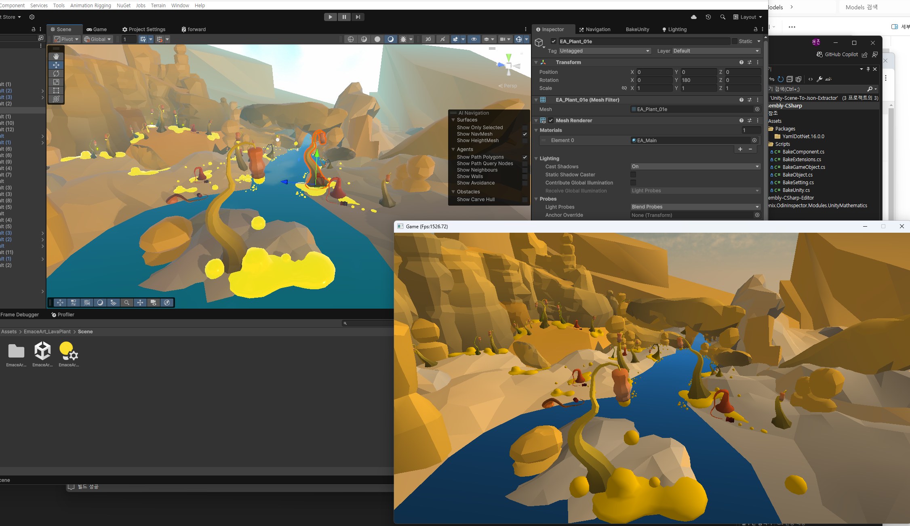
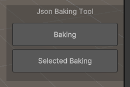
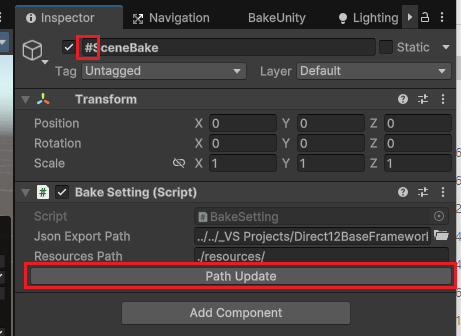
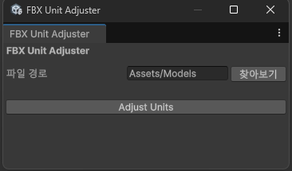

# Unity Scene & Object To Json Exporter
 **Extractor that converts and saves Unity scenes in JSON format.**

### Package Manager Dependencies
 - **Newtonsoft.Json** ( Add package by name  : "com.unity.nuget.newtonsoft-json" )  
 - **FBX Exporter** ( Add Unity Registry : "FBX Exporter" )  

*(Dependency Installation Required)*  
*(종속성 설치 필요.)*  

  
*(Direct12 Load Example)*

**GUID Based Reference Link Serialized**
### Two-Step Processing
1. **Preprocessing**: Assign GUIDs and compile a list of objects
2. **Baking**: Serialize to JSON and update GUID references

## Format Structure
``` json
// Base Structure
{
  "references": {
    "GameObjects": [objs...]
    "Components": [objs...]
    "Materials": [objs...]
  }
}


//GameObject Examples
"GameObjects": [
      {
        "name": "Cube3",
        "guid": "96f957c0-6f4a-4458-850c-8a9d5a305da6",
        "components": [
          "e52ef39c-ab6d-4ed4-98c3-851af5373b4d",
          "2117b32e-1b67-4754-91fc-b4bfb83246a3",
          "6a09c07c-8743-4d3f-9757-6e3ff6c5b26e",
          "b66945f8-e840-454c-96a7-399db0f14e52"
        ],
        "childs": [],
        "parent": ""
      }
]

//Component Examples
"Components": [
      {
        "type": "Transform",
        "guid": "e52ef39c-ab6d-4ed4-98c3-851af5373b4d",
        "position": [2.97, 1.33, 2.09],
        "rotation": [-0.2558989, 0.297022641, 0.185024753, 0.9011433],
        "scale": [2.8423, 1.0, 5.0188]
      },
      {
        "type": "MeshRenderer",
        "guid": "6a09c07c-8743-4d3f-9757-6e3ff6c5b26e",
        "mesh": {
          "path": "Assets/Models/Cube.fbx",
          "fileName": "Cube.fbx",
          "modelName": "Cube",
          "meshName": "Cube",
          "boundCenter": [0.0, 0.0, 0.0],
          "boundExtent": [0.5, 0.5, 0.5]
        },
        "shadowCast": "On",
        "materials": ["5bd36d02-3804-4490-9699-259351f0ebae"]
      }
]

//Material Examples
"Materials": [
      {
        "name": "LitMaterial2",
        "guid": "5bd36d02-3804-4490-9699-259351f0ebae",
        "shaderName": "forward",
        "renderOrder": 2000,
        "culling": "both",
        "datas": {
          "textures": [
            {
              "name": "_BaseMap",
              "path": "Assets/Models/Kindred/clothes_texture.png",
              "fileName": "clothes_texture.png",
              "originalName": "clothes_texture"
            }
          ],
          "floats":[],
          "ints":[],
          "vectors":[],
          "matrixs": []
        }
      }
]

```

* * *

## Guide  

<details>  
<summary> Guide </summary>  

  
- **Baking:** Bake all GameObjects in the Scene.
- **Selected Baking:** Bake all selected GameObjects in the Hierarchy.

  
 - **Json Export Path:** Sets the path to save the baked JSON file.  
 - **Resources Path:** Replaces the resource path by removing ***./Assets/*** and applying the new path.  
 - **Path Update:** Updates the path to reflect changes for baking.  

  
 - **FBX Unit Adjuster:** Open the window from the top menu ***Tools/FBX Unit Adjuster.***
By clicking the button, it adjusts the *UnitScaleFactor* of all *.fbx* files in the specified path to 1cm.

</details>

* * *


## Example  

<details>
<summary> Json Export Sample </summary>

  
(Unity Scene)  


``` json
{
  "references": {
    "GameObjects": [
      {
        "name": "Cube3",
        "guid": "96f957c0-6f4a-4458-850c-8a9d5a305da6",
        "components": [
          "e52ef39c-ab6d-4ed4-98c3-851af5373b4d",
          "2117b32e-1b67-4754-91fc-b4bfb83246a3",
          "6a09c07c-8743-4d3f-9757-6e3ff6c5b26e",
          "b66945f8-e840-454c-96a7-399db0f14e52"
        ],
        "childs": [],
        "parent": ""
      },
      {
        "name": "Directional Light",
        "guid": "3ff8ebe0-c29a-4bed-ad4e-8ad5fc4085fa",
        "components": [
          "d6144fb5-6a3a-4a65-a2fa-f818e1e9d24d",
          "143f841a-80c7-4f74-a932-9d248781276b"
        ],
        "childs": [],
        "parent": ""
      },
      {
        "name": "Main Camera",
        "guid": "67f96694-cbce-4f25-a75a-53de7c825094",
        "components": [
          "0327f370-6f45-4ee2-8505-7da61c02db06",
          "bb5ae8fb-edda-48b1-b8b0-851eef1ba8ed"
        ],
        "childs": [],
        "parent": ""
      },
      {
        "name": "Quad",
        "guid": "f76089d2-fbca-4510-8c15-ba5c4c038880",
        "components": [
          "8b6b9ac1-c591-449e-8ecc-7efb1120e6de",
          "d3415492-638b-470c-bd44-37ef4bb63b71",
          "ff772039-bee7-4a6b-9f8b-09325729b9b3",
          "853fd1d8-1d53-4c8a-9965-20535050b2bf"
        ],
        "childs": [],
        "parent": ""
      },
      {
        "name": "Plane",
        "guid": "ca1db9eb-9bad-45aa-aa71-6f71dc5c2f2a",
        "components": [
          "8c39817f-51ab-48b4-90d6-312b9e7df1c7",
          "530d24b1-72d6-4bc4-9c83-618bf582dc20",
          "dbee0b26-7d79-41c0-a8b0-8626a7d93597",
          "41ead964-c2b0-430e-895e-c767fd3b03ac"
        ],
        "childs": [],
        "parent": ""
      },
      {
        "name": "Cube2",
        "guid": "0291281b-d1d2-4af0-b830-3772b4a90b06",
        "components": [
          "75e98aed-7943-414b-87a2-602509a90c74",
          "3db2cdf2-22d5-4c0c-944d-25fbf93061ba",
          "37e75600-5eb4-41eb-aecf-ecca6abb1fe6",
          "e56db3f8-ea44-4dc7-85df-318dc5f73581"
        ],
        "childs": [],
        "parent": ""
      },
      {
        "name": "Cube2",
        "guid": "efb2e705-fca0-42b2-95e5-5f4a39a07518",
        "components": [
          "5f54f45c-a701-47db-8e4b-617f7e6d4b8b",
          "22018c99-a337-406f-9924-b9f635314d8a",
          "f1022375-648f-4df7-ac9e-903d6133cdee",
          "96b245d3-3a7c-4839-b2e2-2c089b212286"
        ],
        "childs": [],
        "parent": ""
      }
    ],
    "Materials": [
      {
        "name": "LitMaterial2",
        "guid": "5bd36d02-3804-4490-9699-259351f0ebae",
        "shaderName": "forward",
        "renderOrder": 2000,
        "culling": "both",
        "datas": {
          "textures": [
            {
              "name": "_BaseMap",
              "path": "Assets/Models/Kindred/clothes_texture.png",
              "fileName": "clothes_texture.png",
              "originalName": "clothes_texture"
            }
          ],
          "floats": [
            {
              "name": "_DoClip",
              "data": 0.0
            },
            {
              "name": "_QueueOffset",
              "data": 0.0
            },
            {
              "name": "_QueueControl",
              "data": 0.0
            }
          ],
          "ints": [],
          "vectors": [
            {
              "name": "_Color",
              "data": [1.0, 1.0, 1.0, 1.0]
            },
            {
              "name": "_BaseMap_ST",
              "data": [1.0, 1.0, 0.0, 0.0]
            },
            {
              "name": "_BaseMap_TexelSize",
              "data": [0.00048828125, 0.00048828125, 2048.0, 2048.0]
            },
            {
              "name": "_BaseMap_HDR",
              "data": [1.0, 1.0, 0.0, 0.0]
            },
            {
              "name": "unity_Lightmaps_ST",
              "data": [1.0, 1.0, 0.0, 0.0]
            },
            {
              "name": "unity_Lightmaps_TexelSize",
              "data": [1.0, 1.0, 1.0, 1.0]
            },
            {
              "name": "unity_Lightmaps_HDR",
              "data": [1.0, 1.0, 0.0, 0.0]
            },
            {
              "name": "unity_LightmapsInd_ST",
              "data": [1.0, 1.0, 0.0, 0.0]
            },
            {
              "name": "unity_LightmapsInd_TexelSize",
              "data": [1.0, 1.0, 1.0, 1.0]
            },
            {
              "name": "unity_LightmapsInd_HDR",
              "data": [1.0, 1.0, 0.0, 0.0]
            },
            {
              "name": "unity_ShadowMasks_ST",
              "data": [1.0, 1.0, 0.0, 0.0]
            },
            {
              "name": "unity_ShadowMasks_TexelSize",
              "data": [1.0, 1.0, 1.0, 1.0]
            },
            {
              "name": "unity_ShadowMasks_HDR",
              "data": [1.0, 1.0, 0.0, 0.0]
            }
          ],
          "matrixs": []
        }
      },
      {
        "name": "LitMaterial",
        "guid": "8af1d1c3-06d4-49fa-bf0e-96bce036942d",
        "shaderName": "forward",
        "renderOrder": 2000,
        "culling": "both",
        "datas": {
          "textures": [],
          "floats": [
            {
              "name": "_DoClip",
              "data": 0.0
            },
            {
              "name": "_QueueOffset",
              "data": 0.0
            },
            {
              "name": "_QueueControl",
              "data": 0.0
            }
          ],
          "ints": [],
          "vectors": [
            {
              "name": "_Color",
              "data": [1.0, 1.0, 1.0, 1.0]
            },
            {
              "name": "_BaseMap_ST",
              "data": [1.0, 1.0, 0.0, 0.0]
            },
            {
              "name": "_BaseMap_TexelSize",
              "data": [1.0, 1.0, 1.0, 1.0]
            },
            {
              "name": "_BaseMap_HDR",
              "data": [1.0, 1.0, 0.0, 0.0]
            },
            {
              "name": "unity_Lightmaps_ST",
              "data": [1.0, 1.0, 0.0, 0.0]
            },
            {
              "name": "unity_Lightmaps_TexelSize",
              "data": [1.0, 1.0, 1.0, 1.0]
            },
            {
              "name": "unity_Lightmaps_HDR",
              "data": [1.0, 1.0, 0.0, 0.0]
            },
            {
              "name": "unity_LightmapsInd_ST",
              "data": [1.0, 1.0, 0.0, 0.0]
            },
            {
              "name": "unity_LightmapsInd_TexelSize",
              "data": [1.0, 1.0, 1.0, 1.0]
            },
            {
              "name": "unity_LightmapsInd_HDR",
              "data": [1.0, 1.0, 0.0, 0.0]
            },
            {
              "name": "unity_ShadowMasks_ST",
              "data": [1.0, 1.0, 0.0, 0.0]
            },
            {
              "name": "unity_ShadowMasks_TexelSize",
              "data": [1.0, 1.0, 1.0, 1.0]
            },
            {
              "name": "unity_ShadowMasks_HDR",
              "data": [1.0, 1.0, 0.0, 0.0]
            }
          ],
          "matrixs": []
        }
      },
      {
        "name": "Body_texture",
        "guid": "9c2960df-be6e-4f59-bbcf-535c19966671",
        "shaderName": "forward",
        "renderOrder": 2000,
        "culling": "both",
        "datas": {
          "textures": [
            {
              "name": "_BaseMap",
              "path": "Assets/Models/Kindred/Body_texture.png",
              "fileName": "Body_texture.png",
              "originalName": "Body_texture"
            }
          ],
          "floats": [
            {
              "name": "_QueueOffset",
              "data": 0.0
            },
            {
              "name": "_QueueControl",
              "data": 0.0
            }
          ],
          "ints": [],
          "vectors": [
            {
              "name": "_Color",
              "data": [1.0, 1.0, 1.0, 1.0]
            },
            {
              "name": "_BaseMap_ST",
              "data": [1.0, 1.0, 0.0, 0.0]
            },
            {
              "name": "_BaseMap_TexelSize",
              "data": [0.00048828125, 0.00048828125, 2048.0, 2048.0]
            },
            {
              "name": "_BaseMap_HDR",
              "data": [1.0, 1.0, 0.0, 0.0]
            },
            {
              "name": "unity_Lightmaps_ST",
              "data": [1.0, 1.0, 0.0, 0.0]
            },
            {
              "name": "unity_Lightmaps_TexelSize",
              "data": [1.0, 1.0, 1.0, 1.0]
            },
            {
              "name": "unity_Lightmaps_HDR",
              "data": [1.0, 1.0, 0.0, 0.0]
            },
            {
              "name": "unity_LightmapsInd_ST",
              "data": [1.0, 1.0, 0.0, 0.0]
            },
            {
              "name": "unity_LightmapsInd_TexelSize",
              "data": [1.0, 1.0, 1.0, 1.0]
            },
            {
              "name": "unity_LightmapsInd_HDR",
              "data": [1.0, 1.0, 0.0, 0.0]
            },
            {
              "name": "unity_ShadowMasks_ST",
              "data": [1.0, 1.0, 0.0, 0.0]
            },
            {
              "name": "unity_ShadowMasks_TexelSize",
              "data": [1.0, 1.0, 1.0, 1.0]
            },
            {
              "name": "unity_ShadowMasks_HDR",
              "data": [1.0, 1.0, 0.0, 0.0]
            }
          ],
          "matrixs": []
        }
      }
    ],
    "Components": [
      {
        "type": "Transform",
        "guid": "e52ef39c-ab6d-4ed4-98c3-851af5373b4d",
        "position": [2.97, 1.33, 2.09],
        "rotation": [-0.2558989, 0.297022641, 0.185024753, 0.9011433],
        "scale": [2.8423, 1.0, 5.0188]
      },
      {
        "type": "MeshFilter",
        "guid": "2117b32e-1b67-4754-91fc-b4bfb83246a3",
        "mesh": {
          "path": "Assets/Models/Cube.fbx",
          "fileName": "Cube.fbx",
          "modelName": "Cube",
          "meshName": "Cube",
          "boundCenter": [0.0, 0.0, 0.0],
          "boundExtent": [0.5, 0.5, 0.5]
        }
      },
      {
        "type": "MeshRenderer",
        "guid": "6a09c07c-8743-4d3f-9757-6e3ff6c5b26e",
        "mesh": {
          "path": "Assets/Models/Cube.fbx",
          "fileName": "Cube.fbx",
          "modelName": "Cube",
          "meshName": "Cube",
          "boundCenter": [0.0, 0.0, 0.0],
          "boundExtent": [0.5, 0.5, 0.5]
        },
        "shadowCast": "On",
        "materials": ["5bd36d02-3804-4490-9699-259351f0ebae"]
      },
      {
        "type": "BoxCollider",
        "guid": "b66945f8-e840-454c-96a7-399db0f14e52",
        "aabbCenter": [2.96999979, 1.32999992, 2.09000015],
        "aabbExtent": [2.421537, 2.09131145, 2.80896854],
        "isTrigger": false,
        "colliderType": "box",
        "center": [0.0, 0.0, 0.0],
        "size": [1.0, 1.0, 1.0]
      },
      {
        "type": "Transform",
        "guid": "d6144fb5-6a3a-4a65-a2fa-f818e1e9d24d",
        "position": [3.94, 3.0, -4.0],
        "rotation": [0.308929265, -0.360655159, 0.1279627, 0.870698631],
        "scale": [1.0, 1.0, 1.0]
      },
      {
        "type": "Light",
        "guid": "143f841a-80c7-4f74-a932-9d248781276b",
        "lightType": "Directional",
        "color": [0.987158656, 1.0, 0.9009434, 1.0],
        "intensity": 1.0,
        "range": 9.7,
        "innerSpotAngle": 21.80208,
        "spotAngle": 30.0,
        "shadowAngle": 0.0
      },
      {
        "type": "Transform",
        "guid": "0327f370-6f45-4ee2-8505-7da61c02db06",
        "position": [0.0, 1.32, -9.19],
        "rotation": [0.0, 0.0, 0.0, 1.0],
        "scale": [1.0, 1.0, 1.0]
      },
      {
        "type": "Camera",
        "guid": "bb5ae8fb-edda-48b1-b8b0-851eef1ba8ed",
        "isOrtho": false,
        "orthoSize": 5.0,
        "near": 0.3,
        "far": 1000.0,
        "fovy": 66.83109
      },
      {
        "type": "Transform",
        "guid": "8b6b9ac1-c591-449e-8ecc-7efb1120e6de",
        "position": [-2.95, 2.3, -0.25],
        "rotation": [-0.0613024645, -0.39296478, -0.159649923, 0.9035113],
        "scale": [4.2032, 2.7435, 1.0]
      },
      {
        "type": "MeshFilter",
        "guid": "d3415492-638b-470c-bd44-37ef4bb63b71",
        "mesh": {
          "path": "Assets/Models/Quad.fbx",
          "fileName": "Quad.fbx",
          "modelName": "Quad",
          "meshName": "Quad",
          "boundCenter": [0.0, 0.0, 0.0],
          "boundExtent": [0.5, 0.5, 3.0616168e-17]
        }
      },
      {
        "type": "MeshRenderer",
        "guid": "ff772039-bee7-4a6b-9f8b-09325729b9b3",
        "mesh": {
          "path": "Assets/Models/Quad.fbx",
          "fileName": "Quad.fbx",
          "modelName": "Quad",
          "meshName": "Quad",
          "boundCenter": [0.0, 0.0, 0.0],
          "boundExtent": [0.5, 0.5, 3.0616168e-17]
        },
        "shadowCast": "On",
        "materials": ["8af1d1c3-06d4-49fa-bf0e-96bce036942d"]
      },
      {
        "type": "MeshCollider",
        "guid": "853fd1d8-1d53-4c8a-9965-20535050b2bf",
        "aabbCenter": [-2.95, 2.3, -0.25],
        "aabbExtent": [1.80723262, 1.79655242, 1.55363762],
        "isTrigger": false,
        "colliderType": "mesh",
        "convex": false,
        "mesh": {
          "path": "Assets/Models/Quad.fbx",
          "fileName": "Quad.fbx",
          "modelName": "Quad",
          "meshName": "Quad",
          "boundCenter": [0.0, 0.0, 0.0],
          "boundExtent": [0.5, 0.5, 3.0616168e-17]
        }
      },
      {
        "type": "Transform",
        "guid": "8c39817f-51ab-48b4-90d6-312b9e7df1c7",
        "position": [-0.03, -0.2, -0.08],
        "rotation": [0.0, 0.0, 0.0, 1.0],
        "scale": [10.0, 1.0, 10.0]
      },
      {
        "type": "MeshFilter",
        "guid": "530d24b1-72d6-4bc4-9c83-618bf582dc20",
        "mesh": {
          "path": "Assets/Models/Cube.fbx",
          "fileName": "Cube.fbx",
          "modelName": "Cube",
          "meshName": "Cube",
          "boundCenter": [0.0, 0.0, 0.0],
          "boundExtent": [0.5, 0.5, 0.5]
        }
      },
      {
        "type": "MeshRenderer",
        "guid": "dbee0b26-7d79-41c0-a8b0-8626a7d93597",
        "mesh": {
          "path": "Assets/Models/Cube.fbx",
          "fileName": "Cube.fbx",
          "modelName": "Cube",
          "meshName": "Cube",
          "boundCenter": [0.0, 0.0, 0.0],
          "boundExtent": [0.5, 0.5, 0.5]
        },
        "shadowCast": "On",
        "materials": ["8af1d1c3-06d4-49fa-bf0e-96bce036942d"]
      },
      {
        "type": "BoxCollider",
        "guid": "41ead964-c2b0-430e-895e-c767fd3b03ac",
        "aabbCenter": [-0.03000021, -0.199999988, -0.07999992],
        "aabbExtent": [5.0, 0.5, 5.0],
        "isTrigger": false,
        "colliderType": "box",
        "center": [0.0, 0.0, 0.0],
        "size": [1.0, 1.0, 1.0]
      },
      {
        "type": "Transform",
        "guid": "75e98aed-7943-414b-87a2-602509a90c74",
        "position": [-3.07, 0.53, -1.49],
        "rotation": [-0.219655544, 0.267087072, 0.169872016, 0.9227998],
        "scale": [1.0, 1.0, 1.0]
      },
      {
        "type": "MeshFilter",
        "guid": "3db2cdf2-22d5-4c0c-944d-25fbf93061ba",
        "mesh": {
          "path": "Assets/Models/Cube.fbx",
          "fileName": "Cube.fbx",
          "modelName": "Cube",
          "meshName": "Cube",
          "boundCenter": [0.0, 0.0, 0.0],
          "boundExtent": [0.5, 0.5, 0.5]
        }
      },
      {
        "type": "MeshRenderer",
        "guid": "37e75600-5eb4-41eb-aecf-ecca6abb1fe6",
        "mesh": {
          "path": "Assets/Models/Cube.fbx",
          "fileName": "Cube.fbx",
          "modelName": "Cube",
          "meshName": "Cube",
          "boundCenter": [0.0, 0.0, 0.0],
          "boundExtent": [0.5, 0.5, 0.5]
        },
        "shadowCast": "On",
        "materials": ["5bd36d02-3804-4490-9699-259351f0ebae"]
      },
      {
        "type": "BoxCollider",
        "guid": "e56db3f8-ea44-4dc7-85df-318dc5f73581",
        "aabbCenter": [-3.07, 0.53, -1.49],
        "aabbExtent": [0.8243878, 0.7690544, 0.8215248],
        "isTrigger": false,
        "colliderType": "box",
        "center": [0.0, 0.0, 0.0],
        "size": [1.0, 1.0, 1.0]
      },
      {
        "type": "Transform",
        "guid": "5f54f45c-a701-47db-8e4b-617f7e6d4b8b",
        "position": [-75.94346, 160.4764, -185.330109],
        "rotation": [-0.219655544, 0.267087072, 0.169872016, 0.9227998],
        "scale": [0.0, 0.0, 0.0]
      },
      {
        "type": "MeshFilter",
        "guid": "22018c99-a337-406f-9924-b9f635314d8a",
        "mesh": {
          "path": "Assets/Models/Sphere.fbx",
          "fileName": "Sphere.fbx",
          "modelName": "Sphere",
          "meshName": "Sphere",
          "boundCenter": [0.0, 0.0, 0.0],
          "boundExtent": [0.5, 0.5, 0.5]
        }
      },
      {
        "type": "MeshRenderer",
        "guid": "f1022375-648f-4df7-ac9e-903d6133cdee",
        "mesh": {
          "path": "Assets/Models/Sphere.fbx",
          "fileName": "Sphere.fbx",
          "modelName": "Sphere",
          "meshName": "Sphere",
          "boundCenter": [0.0, 0.0, 0.0],
          "boundExtent": [0.5, 0.5, 0.5]
        },
        "shadowCast": "On",
        "materials": ["9c2960df-be6e-4f59-bbcf-535c19966671"]
      },
      {
        "type": "BoxCollider",
        "guid": "96b245d3-3a7c-4839-b2e2-2c089b212286",
        "aabbCenter": [-75.94346, 160.4764, -185.330109],
        "aabbExtent": [0.0, 0.0, 0.0],
        "isTrigger": false,
        "colliderType": "box",
        "center": [0.0, 0.0, 0.0],
        "size": [1.0, 1.0, 1.0]
      }
    ]
  }
}

```

</details>